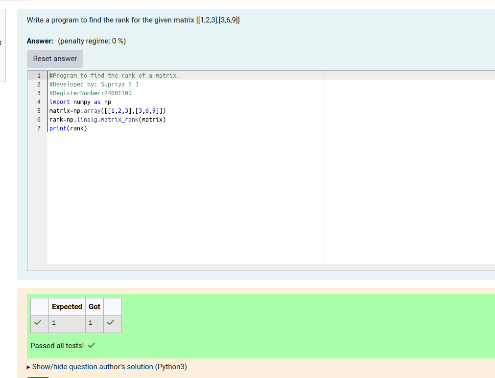

# RANK-OF-A-MATRIX
## Aim:
To write a python program to find the rank of a matrix
## Equipment’s required:
1. 	Hardware – PCs
2. 	Anaconda – Python 3.7 Installation / Moodle-Code Runner
## Algorithm:
### Step 1: 
Import the numpy module to use the built-in functions for calculation
### Step 2: 
Prepare the lists from each linear equations and assign in np.array()
### Step 3:
Using the np.linalg.matrix_rank(), we can find the rank of the given matrix.
### Step 4:
End the program
## Program:

#Program to find the rank of a matrix.

#Developed by: Supriya S J

#RegisterNumber:24001109

import numpy as np

matrix=np.array([[1,2,3],[3,6,9]])

rank=np.linalg.matrix_rank(matrix)

print(rank)

## Output:

## Result:

Thus the rank for the given matrix is successfully solved by  using a python program.

